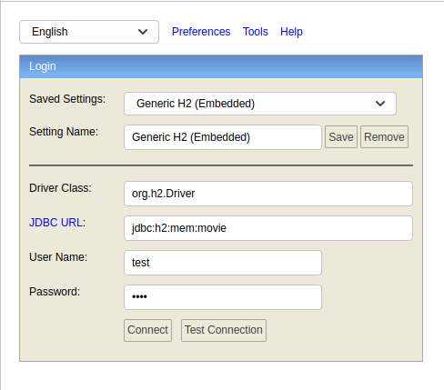
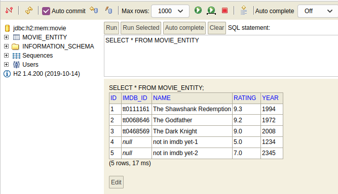

# CRUD-API with Spring Boot and H2 [plus TDD]
TDD with Spring Boot and H2.

## H2 Console
H2 under the hood creates a database that has a console and is accessible by visiting  
http://localhost:8080/h2-console

## Curl Commands to Test Application

- List all movies

    curl -X GET http://localhost:8080/api/movies

- View single movie
  
    curl -X GET http://localhost:8080/api/movies/2

- Create a new movie

    curl -d "{\"name\":\"Forrest Gump\",\"year\":1994,\"rating\":8.8,\"imdbId\":\"tt0109830\"}" -H 'Content-Type: application/json' -X POST http://localhost:8080/api/movies

- Update the existing movie

    curl -d "{\"name\":\"not in imdb yet-2-v2\",\"year\":3456,\"rating\":7.7,\"imdbId\":\"tt1234567\"}" -H 'Content-Type: application/json' -X PUT http://localhost:8080/api/movies/5

- Delete the movie

    curl -X DELETE http://localhost:8080/api/movies/2
